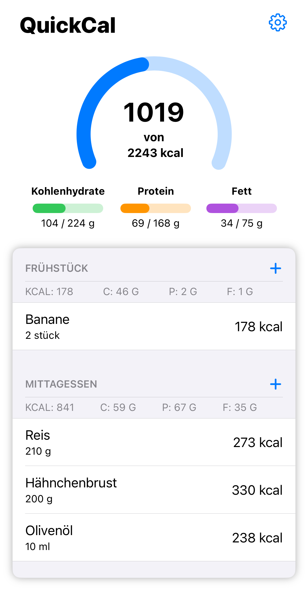
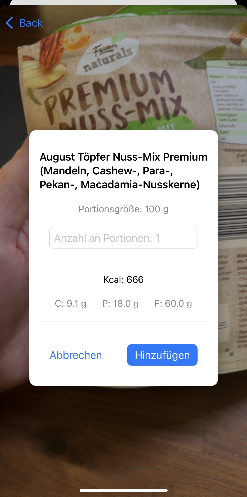

# QuickCal
An iOS application based on the SwiftUI framework that helps users track their nutrition and calculate personal calorie and macronutrient goals. The app is built following the MVVM architectural pattern and stores user data using Core Data. To expand the database, external food databases are integrated via API (OpenFoodFacts), so the user can search and scan product barcodes for ease of use.

## Frameworks
- SwiftUI
- Core Data
- AVFoundation
- Combine

## Note
This application is part of my project module at Trier University of Applied Sciences (Master's program in Computer Science) and is currently under development.

## Screenshots

### Main View

### Profile Creation

### Tracked View

### Barcode View

