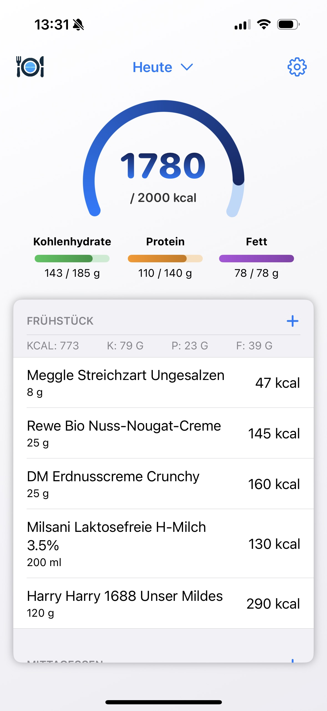
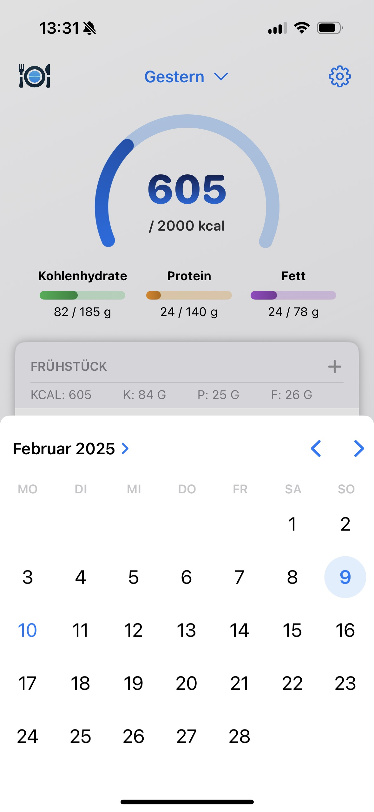
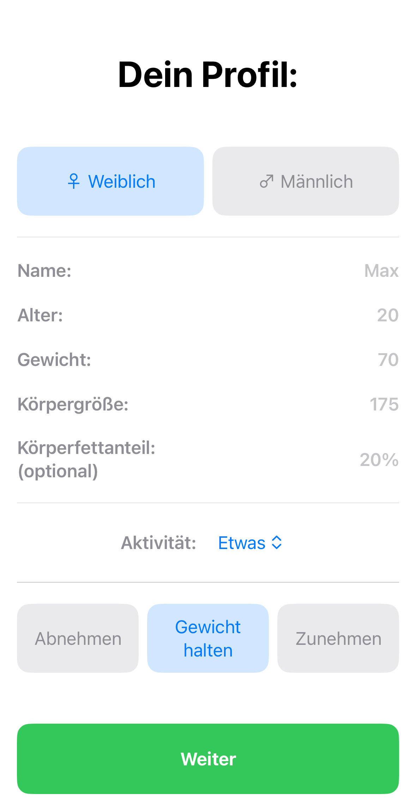
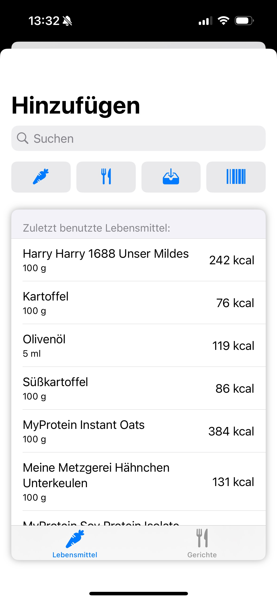
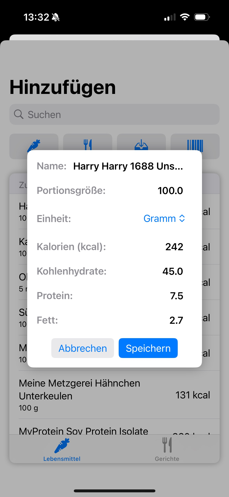
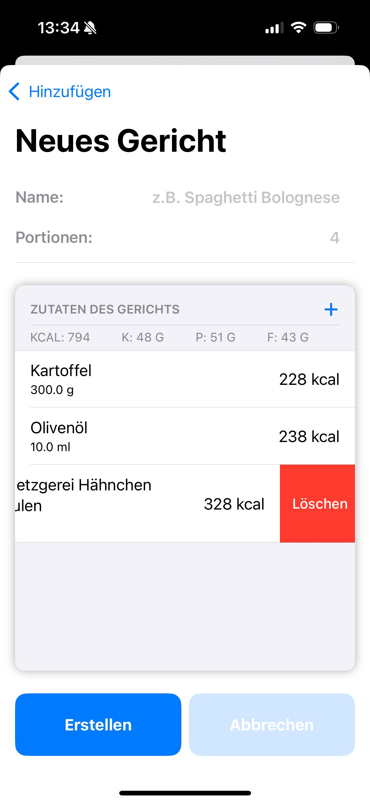
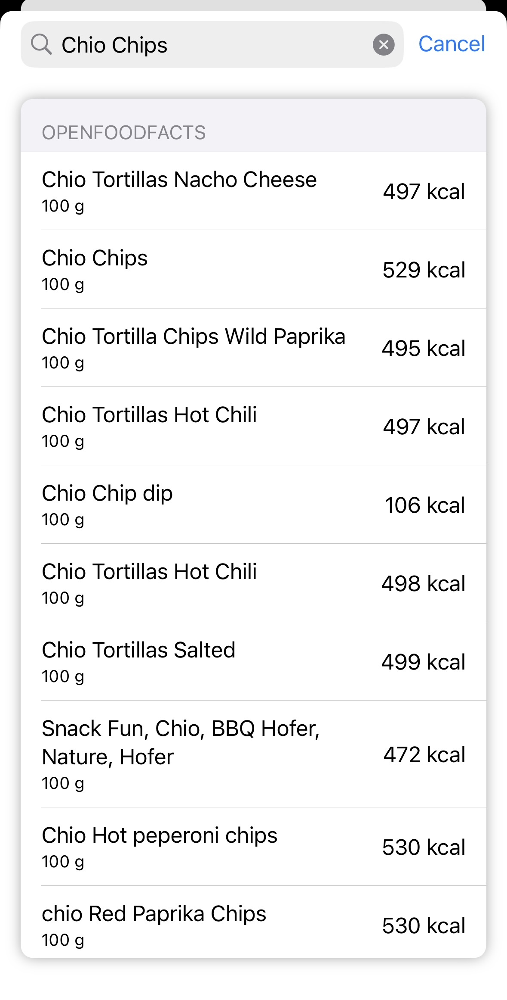
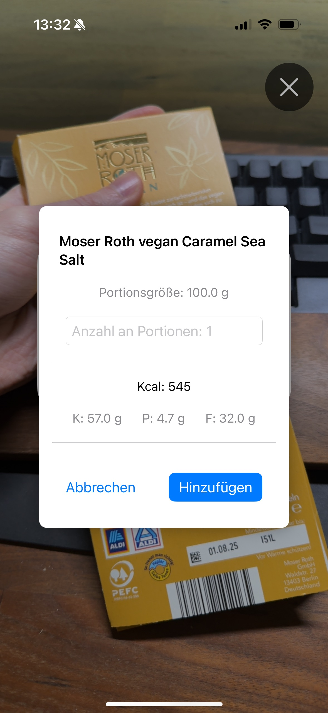
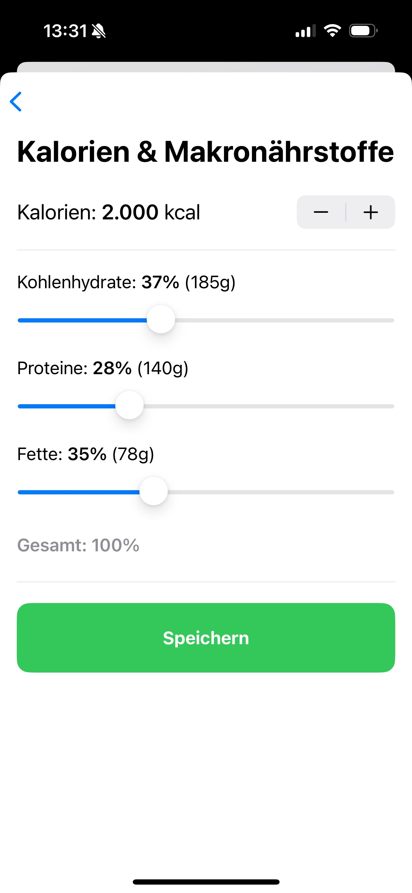

# QuickCal
QuickCal is an iOS app designed to help users track their nutrition and calculate personalized calorie and macronutrient goals. The app is built using the SwiftUI framework, follows the MVVM architectural pattern, and stores user data with Core Data. By integrating external food databases via REST APIs (OpenFoodFacts), users can easily search for foods and scan barcodes, supported by the AVFoundation framework.
User privacy is a top priority — no personal data ever leaves the app, ensuring complete data security.

---

## 🛠 Development Phase
This app is part of my project work for the Master's program in Computer Science at Trier University of Applied Sciences and is currently in beta. Future updates will bring new features and improvements.

---

## 🌍 Data Source
QuickCal operates using the open-source database **OpenFoodFacts**, which contains a wide range of food items maintained and expanded by the community.

[Learn more about OpenFoodFacts](https://world.openfoodfacts.org/)

---

## 💡 Feedback
Since QuickCal is still in development, **suggestions and feedback** are always welcome! 🚀 If you're interested in testing QuickCal via TestFlight, feel free to contact me directly.

The official release is planned for March to April 2025.

---

## 🧰 Frameworks
- SwiftUI
- Core Data
- AVFoundation
- Combine

---

## 📸 Screenshots

### Get a perfect overview of your day

### Quickly switch between different days to plan ahead or to track your calories at a later point

### Profiles are created with science-based algorithms to ensure every users caloric and macronutrients are met

### Select from past entries, create your own, search Open Food Facts or quickly scan barcodes

### Something is incorrect or you mistyped your own foods? Quickly edit your entries

### Instead of adding all your ingredients again and again, how about creating your own meals / recipes?

### Search for food in the open source database Open Food Facts

### Scan product barcodes for an even faster way to add your food

### To fit your personal needs, you can also bypass the app's algorithm and adjust your calories and macronutrients yourself

